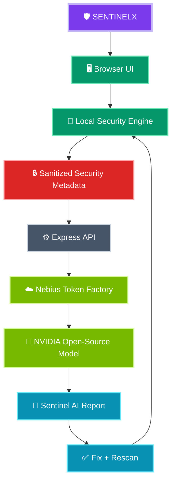

<div align="center">

# 🛡️ SENTINELX

### Your Personal AI Security Copilot

**Detect risk → Understand it with AI → Fix it → Rescan**

[](https://www.typescriptlang.org/)
[](https://react.dev/)
[](https://www.nvidia.com/en-us/ai-data-science/foundation-models/nemotron/)
[](LICENSE)

</div>

---

## 🎯 What is SENTINELX?

SENTINELX is a **privacy-first cybersecurity web application** that separates measurable security checks from AI interpretation.

The browser-side engine calculates credential posture locally — including weak credentials, reuse, and stale credentials. Only **sanitized, non-secret security metadata** is sent to the AI boundary for explanation and prioritization.

> **Demo rule: use synthetic credentials only. Never enter real passwords or secrets.**

## ✨ Core capabilities

| Capability | Description |
|---|---|
| 🔍 Local Security Scan | Deterministic checks for weak, reused, and stale demo credentials. |
| 📊 Security Posture | A 0–100 score with concrete findings and remediation priorities. |
| 🤖 Sentinel AI | Uses an NVIDIA open-source model through the configured AI gateway to explain security findings. |
| 🔐 Privacy Boundary | Rejects common credential/secret-bearing fields and markers before upstream inference. |
| 🪄 Secure Generator | Generates 16–128 character credentials with browser Web Crypto. |
| 🔧 Fix Risk | Immediately rotates a synthetic demo credential and lets the user rescan. |
| 🛡️ Deterministic Fallback | Local recommendations remain available when AI inference is unavailable. |
| 🧪 Test Coverage | Automated tests cover scoring, sanitization, privacy blocking, and credential generation. |

## 🧭 Architecture



## 🔐 Privacy model

The AI API is intentionally narrow:

- The security-analysis endpoint accepts aggregate metadata rather than credential records.
- The chat endpoint validates both the user message and the context before sending anything upstream.
- Common secret-bearing keys such as `password`, `api_key`, `access_token`, and `private_key` are rejected.
- AI failures return a deterministic local recommendation instead of exposing internal provider errors.

See [`SECURITY.md`](SECURITY.md) and [`docs/ARCHITECTURE.md`](docs/ARCHITECTURE.md) for details.

## 🧰 Tech stack

**Frontend:** React 19, TypeScript, Vite, Tailwind CSS, Lucide, Motion

**Backend:** Node.js, Express, TypeScript, dotenv

**AI:** Nebius Token Factory with a configurable NVIDIA open-source model

**Security:** Web Crypto API, local deterministic scoring, privacy boundary, fallback analysis

## 🚀 Getting started

### 1. Install dependencies

```bash
npm install
```

### 2. Configure the AI provider

Copy `.env.example` to `.env` and provide your own credentials locally.

```bash
cp .env.example .env
```

Never commit `.env` or provider credentials.

### 3. Run development mode

```bash
npm run dev
```

Then open the local URL shown by the server.

### 4. Verify the project

```bash
npm run lint
npm test
npm run build
```

## 🧪 Testing

The test suite in [`tests/security.test.ts`](tests/security.test.ts) validates the shared security engine, including deterministic scoring, sanitized metadata generation, secret detection, and Web Crypto credential generation.

## 📁 Project structure

```text
SENTINELX/
├── src/
│   ├── App.tsx          # React application UI
│   ├── index.css        # Application styling
│   ├── main.tsx         # React entry point
│   └── security.ts      # Shared security/privacy engine
├── tests/
│   └── security.test.ts # Security and privacy tests
├── docs/
│   └── ARCHITECTURE.md  # Architecture and data-flow notes
├── .env.example         # Safe configuration template
├── SECURITY.md          # Security policy
├── SUBMISSION.md        # NVIDIA demo/submission notes
├── LICENSE              # MIT license
├── package.json
├── server.ts            # Express + AI gateway
└── vite.config.ts
```

## ⚠️ Demo limitations

SENTINELX is currently a **showcase/hackathon application**, not a production password manager. Demo credentials live in browser memory and are synthetic. Persistent encrypted vault storage, real breach intelligence, enterprise identity controls, and production-grade secret management are outside the current scope.

## 🗺️ Roadmap

- [x] Local credential posture scoring
- [x] Weak/reused/stale risk detection
- [x] Web Crypto credential generation
- [x] Privacy-safe AI metadata boundary
- [x] NVIDIA model integration through configurable provider gateway
- [x] Deterministic AI fallback
- [x] Automated security/privacy tests
- [ ] Encrypted persistent vault
- [ ] Passkey / WebAuthn support
- [ ] Breach-intelligence integrations
- [ ] Production authentication and audit logging

## 👨‍💻 Engineered by Mr.Cheeku

Built as a defensive cybersecurity and AI systems demonstration.

- GitHub: https://github.com/MrCheeku
- Website: https://techwithcheeku.lovable.app/

---

<div align="center">

**SENTINELX — Detect • Understand • Fix**

</div>
