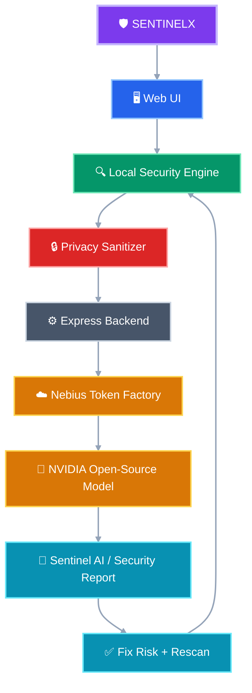

<div align="center">

<a href="https://github.com/MrCheeku"></a>

# 🛡️ SENTINELX

### Your Personal AI Security Copilot

<p><strong>Detect risks • Understand them with AI • Fix them immediately</strong></p>

<a href="https://github.com/MrCheeku"></a>

</div>

---

## 🛡️ What is SENTINELX?

**SENTINELX** is a privacy-first cybersecurity web application that combines deterministic local security analysis with an AI-powered security copilot.

> **Secrets stay local. Sanitized security metadata can be analyzed by AI.**

The local engine handles measurable checks such as password strength, reuse, freshness, and vault hygiene. The AI layer explains findings, prioritizes risks, and turns them into practical next steps.

## ✨ Highlights

| Capability | What it does |
|---|---|
| **Security Dashboard** | Shows a 0–100 security posture score and current risk summary. |
| **Security Scan** | Detects weak, reused, stale, and incomplete credentials locally. |
| **Sentinel AI** | Explains security findings and creates prioritized recommendations. |
| **Fix with Generator** | Moves directly from a detected risk to a stronger generated credential. |
| **Credential Vault** | Stores and manages credentials with masked secrets. |
| **Secure Generator** | Generates high-entropy passwords using browser cryptographic randomness. |
| **Demo Mode** | Uses synthetic accounts for safe demonstrations. |
| **Privacy Center** | Shows what non-secret metadata can cross the AI boundary. |
| **AI Fallback** | Local security analysis continues when AI inference is unavailable. |
| **Encrypted Backups** | Supports local backup and restore workflows. |

## ✨ Core Experience

```text
Scan → Review Security → Generate AI Insight → Fix Risk → Rescan
```

## 🧰 Tech Stack

<div align="center">

### Frontend


### Backend


### AI & Infrastructure


### Security


</div>

## 🧭 Project Structure



## 🛡️ Security Design

SENTINELX separates **deterministic security facts** from **AI interpretation**. Plaintext passwords, master passwords, encryption keys, raw vault exports, and private credential notes are not sent to the AI layer.

## ☁️ Nebius + NVIDIA AI

The Express backend proxies AI requests to **Nebius Token Factory / Nebius AI Cloud** using an NVIDIA open-source model. Provider credentials remain server-side.

```text
GET  /api/health
POST /api/ai/health
POST /api/security/analyze
POST /api/security/chat
```

## 🚀 Getting Started

```bash
git clone https://github.com/MrCheeku/SentinelX-Clean.git
cd SentinelX-Clean
npm install
npm run dev
```

Create `.env` from `.env.example` and add your own Nebius credentials. Never commit `.env`.

## 🧪 Testing

The project includes verification coverage for local scoring, password checks, reuse detection, credential staleness, vault hygiene, CSPRNG generation, privacy sanitization, backup serialization, and AI proxy/fallback behavior.

## 🧭 Roadmap

- [x] Local security scoring
- [x] Credential risk detection
- [x] Secure password generation
- [x] Privacy-safe AI payloads
- [x] Nebius backend integration
- [x] Sentinel AI workflow
- [x] Demo Mode
- [x] AI fallback behavior
- [ ] Expanded breach intelligence
- [ ] Passkey / WebAuthn support

## 🌐 Official Links

<div align="center">
<a href="https://techwithcheeku.lovable.app/"></a>
<a href="https://whatsapp.com/channel/0029Vb9OpwgD8SDvISwrn73Y"></a>
</div>

## 👨‍💻 Engineered By

<div align="center">
<a href="https://github.com/MrCheeku"></a>

### **Mr.Cheeku**

<a href="https://github.com/MrCheeku"></a>
<br /><br />
<a href="https://discord.gg/GWJvzcxuN"></a>
</div>

---

<div align="center">
<a href="https://github.com/MrCheeku/SentinelX-Clean/issues">Report an issue</a> •
<a href="https://github.com/MrCheeku/SentinelX-Clean">View source</a> •
<a href="https://github.com/MrCheeku/SentinelX-Clean/releases">View releases</a> •
<a href="https://github.com/MrCheeku">Developer profile</a>

<br /><br />

### 🛡️ SENTINELX
**Detect • Understand • Fix**
</div>
