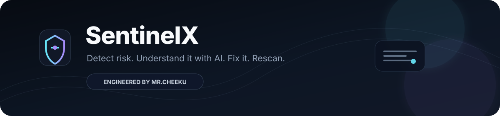
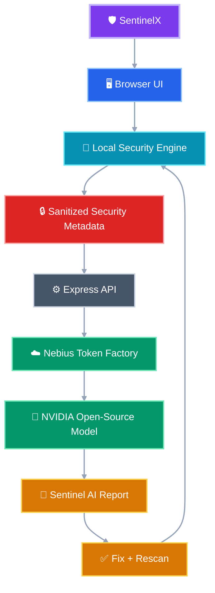

<div align="center">



<p>
  <a href="https://github.com/MrCheeku/SentinelX"></a>
  <a href="https://github.com/MrCheeku/SentinelX"></a>
  <a href="https://github.com/MrCheeku/SentinelX"></a>
</p>

<p><strong>Detect risk • Understand it with AI • Fix it • Rescan</strong></p>

<a href="https://github.com/MrCheeku"></a>

</div>

---

## 🛡️ What is SentinelX?

**SentinelX** is a privacy-first cybersecurity web application that separates measurable security checks from AI interpretation. The browser-side engine calculates security posture locally, while only sanitized, non-secret security metadata is sent to the AI boundary for explanation and prioritization.

> **Demo rule:** use synthetic credentials only. Never enter real passwords, API keys, tokens, or other secrets.

### ✨ Highlights

| Capability | What it does |
|---|---|
| **Local Security Scan** | Runs deterministic checks for weak, reused, and stale synthetic credentials directly in the browser. |
| **Security Posture** | Produces a 0–100 security score with concrete findings and remediation priorities. |
| **Sentinel AI** | Uses an NVIDIA open-source model through the configured AI gateway to explain security findings. |
| **Privacy Boundary** | Blocks common secret-bearing fields and markers before upstream inference. |
| **Secure Generator** | Generates 16–128 character synthetic credentials using browser Web Crypto. |
| **Fix Risk** | Rotates a synthetic demo credential and lets the user rescan immediately. |
| **Deterministic Fallback** | Keeps local remediation guidance available when AI inference is unavailable. |
| **Test Coverage** | Covers scoring, sanitization, privacy blocking, and credential generation. |

---

## ✨ Core Experience

```text
Scan → Score Risk → Explain with AI → Fix Finding → Rescan
```

SentinelX combines a local security engine, privacy boundary, AI gateway, and remediation workflow into one focused defensive-security experience.

---

## 🧰 Tech Stack

<div align="center">

### Frontend & UI


### Backend & API


### AI


### Security


</div>

---

## 🧭 Project Structure

> 🎨 **Interactive Mermaid architecture:** every major layer has its own color, arrows show how the system connects, and the compact top-to-bottom layout is designed for smaller screens.



### 📱 Mobile-friendly note

This is **real Mermaid source — not a picture**. The compact `TB` layout keeps the hierarchy narrow, but GitHub controls Mermaid rendering in each client. If the GitHub Android app displays the Mermaid source instead of the rendered diagram, that is a limitation of that app/version and cannot be forced by README code.

<details>
<summary>📂 View Project Structure as Text</summary>

```text
🛡️ SentinelX
│
├── 🖥️ src/
│   ├── App.tsx
│   ├── index.css
│   ├── main.tsx
│   └── security.ts
│
├── 🧪 tests/
│   └── security.test.ts
│
├── 📚 docs/
│   └── ARCHITECTURE.md
│
├── 🎨 assets/
│   ├── header.svg
│   └── footer.svg
│
├── 🔑 .env.example
├── 🛡️ SECURITY.md
├── 🏆 SUBMISSION.md
├── 📄 LICENSE
├── 📦 package.json
├── ⚙️ server.ts
└── ⚙️ vite.config.ts
```

</details>

### 🔄 How the pieces connect

```text
🖥️ Browser UI
    │
    ├── 🔎 Local Security Engine ────► Score + Findings
    │             │
    │             └──────────────────► Sanitized Metadata
    │                                      │
    └──────────────────────────────────────┴──► ⚙️ Express API
                                                   │
                                                   ▼
                                             ☁️ AI Gateway
                                                   │
                                                   ▼
                                             🧠 NVIDIA Model
                                                   │
                                                   ▼
                                             🤖 AI Report
                                                   │
                                                   ▼
                                             ✅ Fix + Rescan
```

The structure keeps **UI**, **security logic**, **API**, **AI integration**, and **documentation** separated so contributors can locate each responsibility quickly.

---

## 🔐 Security Design

SentinelX currently implements several concrete defensive mechanisms:

- Security posture scoring and credential checks run locally in the browser.
- The AI boundary accepts sanitized security metadata rather than raw credential records for analysis.
- Common secret-bearing keys such as `password`, `api_key`, `access_token`, and `private_key` are rejected by the privacy boundary.
- Credential generation uses the browser **Web Crypto API**.
- AI failures return deterministic local guidance rather than exposing internal provider errors.

See [`SECURITY.md`](SECURITY.md) and [`docs/ARCHITECTURE.md`](docs/ARCHITECTURE.md) for implementation details.

This README describes the current showcase implementation and is not a claim of independent security auditing.

---

## 🚀 Getting Started

### Requirements

- Node.js with npm
- A modern browser
- Optional AI-provider credentials configured locally for the AI features

### Install dependencies

```bash
npm install
```

### Configure the AI provider

Copy `.env.example` to `.env` and provide your own credentials locally.

```bash
cp .env.example .env
```

> Never commit `.env` or provider credentials.

### Run development mode

```bash
npm run dev
```

Then open the local URL shown by the development server.

### Verify the project

```bash
npm run lint
npm test
npm run build
```

---

## 🧪 Testing

The test suite in [`tests/security.test.ts`](tests/security.test.ts) validates the shared security engine, including deterministic scoring, sanitized metadata generation, secret detection, privacy blocking, and Web Crypto credential generation.

```bash
npm test
```

---

## ⚠️ Demo Limitations

SentinelX is currently a **showcase/hackathon application**, not a production password manager. Demo credentials live in browser memory and are synthetic. Persistent encrypted vault storage, real breach intelligence, enterprise identity controls, and production-grade secret management are outside the current scope.

---

## 🗺️ Roadmap

- [x] Local credential posture scoring
- [x] Weak/reused/stale risk detection
- [x] Web Crypto credential generation
- [x] Privacy-safe AI metadata boundary
- [x] NVIDIA model integration through configurable provider gateway
- [x] Deterministic AI fallback
- [x] Automated security/privacy tests
- [ ] Encrypted persistent vault
- [ ] Passkey / WebAuthn support
- [ ] Breach-intelligence integrations
- [ ] Production authentication and audit logging

---

## 🌐 Official Links

<div align="center">

<a href="https://techwithcheeku.lovable.app/"></a>

<a href="https://whatsapp.com/channel/0029Vb9OpwgD8SDvISwrn73Y"></a>

<a href="https://discord.gg/GWJvzcxuN"></a>

</div>

---

## 👨‍💻 Engineered By

<div align="center">

<a href="https://github.com/MrCheeku"></a>

### **Mr.Cheeku**

<a href="https://github.com/MrCheeku"></a>

</div>

---

<div align="center">

<a href="https://github.com/MrCheeku/SentinelX/issues">Report an issue</a>
&nbsp;•&nbsp;
<a href="https://github.com/MrCheeku/SentinelX">View source</a>
&nbsp;•&nbsp;
<a href="https://github.com/MrCheeku">Developer profile</a>

<br /><br />


</div>

<!-- LIVE_STARS: 0 | automatically synced 2026-09-10T19:54:20.158Z -->
